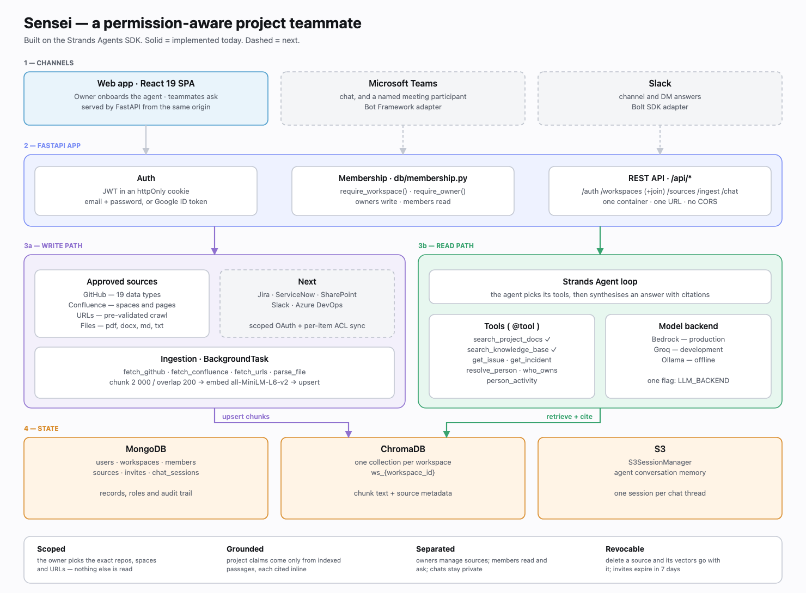

# Sensei

Permission-aware AI platform that ingests your project sources (GitHub, files, URLs, Confluence) into a knowledge base and answers questions with cited sources. Built with Strands Agents SDK for the AWS hackathon.



- **[TESTING.md](TESTING.md)** — demo account, questions to try, how to exercise the invite flow
- **[DEPLOY.md](DEPLOY.md)** — one-container deployment to Fly.io or AWS App Runner
- **[docs/STRATEGY_AND_BUILD_PLAN.md](docs/STRATEGY_AND_BUILD_PLAN.md)** — market analysis and the road after the MVP

## Prerequisites

- Python 3.12+
- Node.js 18+
- MongoDB Atlas account (free tier works)
- Groq API key (free at [console.groq.com](https://console.groq.com))

---

## Setup

### Backend

```bash
cd backend
python3 -m venv venv
source venv/bin/activate      # macOS/Linux
# venv\Scripts\activate       # Windows
pip install -r requirements.txt
cp .env.example .env
```

Edit `backend/.env`:

```
MONGO_DB=mongodb+srv://...
MONGO_DB_NAME=sensei
JWT_SECRET=your-secret-here
GROQ_API_KEY=gsk_...
CHROMA_PERSIST_DIR=./chroma_data
FRONTEND_ORIGIN=http://localhost:5173
DEBUG=true
```

> `DEBUG=true` is required for local HTTP — it drops the `Secure` flag on the
> session cookie so login works without TLS.

### Frontend

```bash
cd frontend
npm install
```

---

## Run

Open two terminals:

**Terminal 1 — Backend**
```bash
cd backend
source venv/bin/activate
uvicorn main:app --reload --port 8000
```

**Terminal 2 — Frontend**
```bash
cd frontend
npm run dev
```

- Frontend: http://localhost:5173
- Backend API: http://localhost:8000/api
- API docs (Swagger): http://localhost:8000/docs

### Or run the whole thing in one container

```bash
docker compose up --build      # builds the SPA, serves everything on :8000
```

The image builds the React app and FastAPI serves it next to `/api/*`, so a
deployment is one container and one URL — no CORS, no second service. In dev,
Vite proxies `/api` straight through, so the paths are identical either way.

---

## How It Works

**As a project owner**

1. **Sign up** → create a workspace (one per user)
2. **Add sources** — GitHub repo (PAT), file upload, URL, or Confluence
3. **Ingest** — sources are chunked and embedded into ChromaDB (runs in background)
4. **Invite your team** — generate a 7-day invite link from the onboarding wizard
5. **Chat** — ask questions, get answers with inline citations linking back to the source

**As a teammate**

1. Open the invite link → sign up or log in (the invite token survives the redirect)
2. You land in the owner's workspace as a **member**
3. **Chat** straight away — you can read what the agent knows and ask anything

Roles: **owners** connect and manage sources; **members** get read-only visibility
into the source list and their own private chat sessions. Access is resolved in one
place, `backend/db/membership.py`, so no route can accidentally skip the check.

GitHub ingestion extracts 19 data types: file contents, commits, contributors, collaborators (including org owners), org members, teams, PRs with reviews, issues, branches, releases, milestones, and CI/CD workflows. See `Agents.md` for details.

---

## Project Structure

```
agents-for-humans/
├── backend/
│   ├── main.py              # FastAPI app + lifespan (MongoDB + ChromaDB)
│   ├── auth/                # JWT auth + Google OAuth
│   ├── workspaces/          # Workspace CRUD + invite links + join
│   ├── sources/             # Source management + file upload
│   ├── ingest/              # Background ingestion trigger + status
│   ├── chat/                # Chat sessions + Groq Q&A
│   ├── agent/
│   │   ├── tools.py         # Strands @tool functions (fetch_github, fetch_urls, etc.)
│   │   └── ingest.py        # Chunking + ChromaDB upsert pipeline
│   ├── db/                  # MongoDB + ChromaDB helpers
│   │   └── membership.py    # require_workspace / require_owner — the access rule
│   └── core/config.py       # Settings
├── frontend/
│   ├── src/
│   │   ├── pages/           # Login, Register, Onboarding, Join, Sources, Chat, Dashboard
│   │   ├── components/      # AppShell, ProtectedRoute, OnboardingRoute
│   │   └── services/        # RTK Query API hooks
│   └── vite.config.ts       # /api proxy → localhost:8000
├── docs/
│   ├── ARCHTECTRUE.md       # Full architecture, API map, DB schema
│   └── PRD.md
└── Agents.md                # Tool functions, AI layer, pipeline details
```
